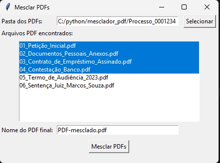

# 🧩 Mescla PDF

<p align="center">
  
</p>

Aplicação em **Python com interface gráfica** para mesclar arquivos PDF de forma rápida, organizada e intuitiva — ideal para quem lida com muitos documentos diariamente, como escritórios jurídicos, cartórios ou departamentos administrativos.

---

##  Funcionalidades

* 📁 Seleção de uma **pasta com arquivos PDF**
* 📃 **Listagem automática** dos PDFs encontrados
* ✅ Seleção **múltipla e personalizada** dos arquivos a serem mesclados
* 📝 Escolha do **nome final do PDF mesclado**
* 📌 **Mesclagem** dos PDFs selecionados em um único arquivo, preservando a ordem

---

## 🚀 Como usar

1. **Clone este repositório:**

   ```bash
   git clone https://github.com/Vini9-6/mescla-pdf.git
   cd mescla-pdf
   ```

2. **(Opcional) Crie e ative um ambiente virtual:**

   ```bash
   python -m venv venv
   venv\Scripts\activate  # Windows
   # ou
   source venv/bin/activate  # macOS/Linux
   ```

3. **Instale as dependências:**

   ```bash
   pip install -r requirements.txt
   ```

4. **Execute o programa:**

   ```bash
   python mescla-pdf.py
   ```

---

## 🛠️ Como gerar um executável (.exe)

1. Instale o PyInstaller:

   ```bash
   pip install pyinstaller
   ```

2. Gere o executável:

   ```bash
   pyinstaller --onefile --windowed mescla-pdf.py
   ```

3. O executável será gerado na pasta `dist/`.

---

## 📁 Estrutura do projeto

```
mescla-pdf/
├── image/
│   └── teste.jpeg
├── pdfs/
│   ├── 01_Peticao_Inicial_Joao_Silva.pdf
│   ├── 02_Documentos_Pessoais_Anexos.pdf
│   ├── 03_Contrato_de_Emprestimo_Assinado.pdf
│   ├── 04_Contestacao_Banco_XYZ.pdf
│   ├── 05_Termo_de_Audiencia_2023-11-14.pdf
│   ├── 06_Sentenca_Juiz.pdf
├── mescla-pdf.py
├── requirements.txt
├── .gitignore
├── LICENSE
└── README.md
```

---

## 📄 Licença

Distribuído sob a **MIT License**.
© 2025 [Vini9-6](https://github.com/Vini9-6)

---

💡 *Dica:* Experimente usar nomes padronizados nos seus PDFs, como `01_Peticao_Inicial.pdf`, `02_Contratos.pdf`, para facilitar a ordenação automática e manter seus arquivos organizados.
